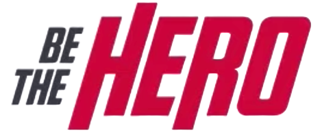

<h1 align="center">
    
     
    <i><b>Backend</b></i>
</h1>

<h4 align="center">
  🚀 Semana OmniStack 11.0
</h4>

  

  
  
  

  

  

  <a href="#rocket-techs">Techs</a>&nbsp;&nbsp;&nbsp;|&nbsp;&nbsp;&nbsp;
  <a href="#-project">About the project</a>&nbsp;&nbsp;&nbsp;|&nbsp;&nbsp;&nbsp;
  <a href="#-contributing">Contributing</a>&nbsp;&nbsp;&nbsp;|&nbsp;&nbsp;&nbsp;
  <a href="#memo-license">License</a>

 

## :rocket: Techs

This project was developed with the following technologies:

- [Node.js](https://nodejs.org/en/)

## 💻 Project

Be the Hero is a platform that aims to help non-governmental organizations to raise funds.

## 🤔 Contributing

- Fork it!
- Create your feature branch: `git checkout -b my-new-feature`;
- Commit your changes: `git commit -m 'feat: My new feature'`;
- Push to the branch: `git push origin my-new-feature`.
- Submit a pull request :D

## :memo: License

This project is licensed under the MIT License. See the [LICENSE](LICENSE.md) file for details.

---

Made with ♥
